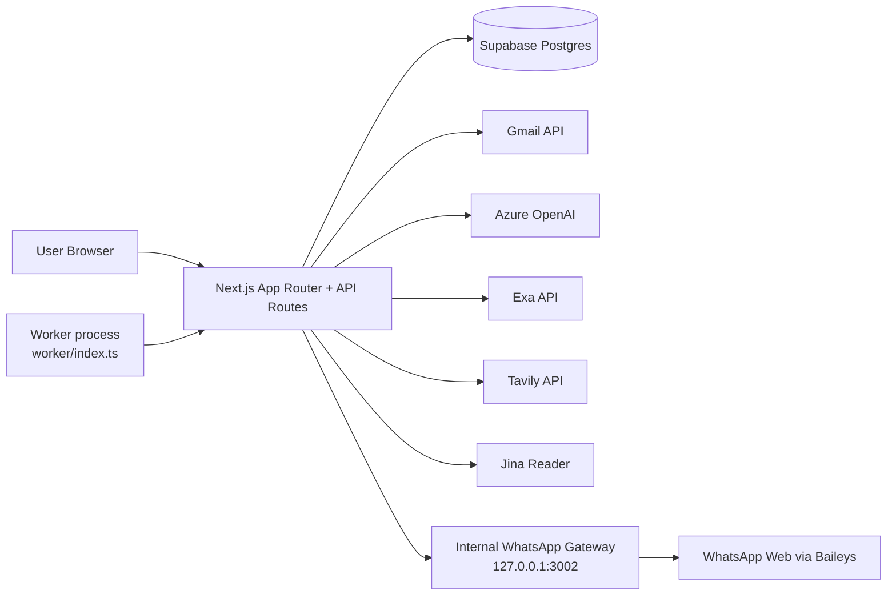

# Web Architecture - ROSEY (COHERENCE-26_NEURALNEXUS)

## 1) Executive Summary
ROSEY is a full-stack **Next.js 16** outreach automation platform with:
- Multi-product workspace model (`products -> leads -> campaigns -> campaign_leads`)
- Visual workflow builder (React Flow + Zustand)
- Background execution engine (polling worker + `/api/engine/run`)
- Multi-channel outreach (Gmail + WhatsApp)
- AI-assisted generation and enrichment (Azure OpenAI + Exa + Tavily + Jina)
- Compliance + deliverability controls (unsubscribe, suppression, warm-up, bounce tracking)

The architecture is a **modular monolith**: UI, API, orchestration logic, and DB access are in one Next.js app, with a separate long-running worker process for scheduled execution and WhatsApp gateway.

## 2) High-Level Topology

## 3) Runtime Components

### 3.1 Frontend (App Router)
- Marketing landing: `/`
- Authenticated product workspace:
  - `/dashboard`
  - `/products/new`
  - `/{productId}/campaigns`
  - `/{productId}/campaigns/{campaignId}` (workflow builder + side panels)
  - `/{productId}/leads`
  - `/{productId}/settings`

Key UI architecture:
- Workflow graph editor: `@xyflow/react` + Zustand store (`stores/workflow-store.ts`)
- Analytics shell with tabs and periodic refresh (`hooks/use-analytics-dashboard.ts`)
- Campaign side-panels:
  - Leads assignment/import
  - Inbox/thread + manual/AI reply
  - Automation context editor
  - Analytics dashboard

### 3.2 API Layer (Next.js Route Handlers)
Core route groups:
- Product CRUD: `/api/products`, `/api/products/[id]`
- Lead CRUD/import/enrichment/find:
  - `/api/leads`, `/api/leads/[id]`, `/api/leads/upload`, `/api/leads/[id]/enrich`, `/api/leads/find`
- Campaign CRUD/run/automation/analytics:
  - `/api/campaigns`, `/api/campaigns/[id]`
  - `/api/campaigns/[id]/run`
  - `/api/campaigns/[id]/leads`
  - `/api/campaigns/[id]/automation`
  - `/api/campaigns/[id]/analytics`
  - `/api/campaigns/[id]/analytics-dashboard`
  - `/api/campaigns/[id]/deliverability`
  - `/api/campaigns/[id]/preview-email`
- Conversation APIs:
  - `/api/campaign-leads/[id]/thread`
  - `/api/campaign-leads/[id]/compose`
  - `/api/campaign-leads/[id]/reply`
- Engine/compliance/deliverability:
  - `/api/engine/run`
  - `/api/compliance/audit`
  - `/api/unsubscribe/[token]`
  - `/api/warmup/schedule`
- WhatsApp bridge endpoints:
  - `/api/whatsapp/status`, `/api/whatsapp/qr`, `/api/whatsapp/session`, `/api/whatsapp/preview`

### 3.3 Workflow Engine (`lib/engine.ts`)
Execution cycle:
1. Fetch active campaigns.
2. Parse workflow JSON (`lib/workflow-engine.ts`).
3. Ensure Gmail label per campaign.
4. Enforce per-hour send budget with warm-up overlay.
5. Claim due `campaign_leads` rows atomically (`queued|waiting -> active`).
6. Execute node handlers (`start`, `send_email`, `send_whatsapp`, `wait`, `condition`, `auto_reply`, `end`).
7. Persist campaign lead state + logs + deliverability events.
8. Auto-complete campaign when no active/queued/waiting rows remain.

### 3.4 Worker + Scheduler (`worker/index.ts`)
- Polls `/api/engine/run` every 10s.
- Adds `Authorization: Bearer WORKER_SECRET` when configured.
- Boots and hosts internal WhatsApp gateway on `127.0.0.1:3002`:
  - `/status`, `/qr`, `/send`, `/check-reply`, `/session`
- Uses Baileys multi-file auth persistence in local folder (`whatsapp-session`).

## 4) Data Architecture (Supabase/Postgres)

Primary entities:
- `products`: product metadata + `knowledge_base` JSONB
- `leads`: lead profile + enrichment + custom fields + phone
- `campaigns`: workflow JSON + status + rate limit + `automation_context` JSONB
- `campaign_leads`: execution state per lead per campaign + thread/WA state
- `logs`: action/event log

Compliance + deliverability entities:
- `suppression_list`
- `unsubscribes`
- `warmup_schedules`
- `deliverability_events`

Schema evolution is migration-driven (`supabase/migrations/001..013`).

## 5) Workflow Node Semantics
Supported normalized node types:
- `start`
- `send_email`
- `send_whatsapp`
- `wait`
- `condition` (`yes/no` branches required)
- `auto_reply` (`answered/unanswered` branches required)
- `end`

Notable behavior:
- `send_email` supports `personalized` and `same_for_all` cache mode.
- `wait` sets `next_action_time` and returns `waiting` outcome.
- `condition` can evaluate Gmail thread reply or WhatsApp reply.
- `auto_reply` answers only when LLM confirms knowledge-base sufficiency.

## 6) Integrations

### 6.1 Gmail
- OAuth-based send/read/thread operations via Google API.
- Maintains thread continuity using `threadId`, `In-Reply-To`, and `References`.
- Applies campaign label per thread/message.

### 6.2 WhatsApp
- Baileys WebSocket session in worker process.
- Next.js calls internal local gateway for send + reply checks.

### 6.3 AI/Research
- Azure OpenAI: email generation, auto-reply decisions, WhatsApp copy, lead extraction reasoning, enrichment synthesis.
- Exa: profile/news retrieval for enrichment.
- Tavily: lead discovery search.
- Jina reader proxy: webpage text extraction.

## 7) Security and Access Control

Current controls:
- Clerk middleware protects dashboard/product routes and API matcher.
- Worker endpoint `/api/engine/run` can require bearer secret.
- Unsubscribe tokens use HMAC verification.

Observed architectural risks:
- API handlers generally do **not** enforce per-user ownership checks on `productId/campaignId/leadId`.
- Server-side Supabase usage relies on `SUPABASE_SERVICE_ROLE_KEY`, which bypasses row-level security if misused.
- Secrets are environment-heavy; strict secret management and rotation are critical.

## 8) Deployment Architecture

Containerization:
- Multi-stage Dockerfile (`deps -> builder -> runner`)
- Next output mode: `standalone`
- App serves on `0.0.0.0:8080` in container

Runtime split (recommended in production):
- Service A: Next.js web/API container
- Service B: Worker process container/VM (`pnpm worker`) for polling + WA gateway
- Shared DB: Supabase Postgres

## 9) End-to-End Request/Execution Flows

### 9.1 Campaign activation
1. UI calls `POST /api/campaigns/{id}/run`.
2. Backend validates workflow, assigns product leads into `campaign_leads`.
3. Campaign status -> `active`.
4. Immediate engine invocation processes due leads.

### 9.2 Automated send tick
1. Worker calls `POST /api/engine/run`.
2. Engine processes due leads per campaign budget.
3. Sends email/WhatsApp, logs outcomes, updates next node/time.

### 9.3 Manual inbox reply
1. UI reads thread via `/api/campaign-leads/{id}/thread`.
2. Optional AI draft via `/compose`.
3. Send via `/reply`, which updates thread state + logs.

### 9.4 Unsubscribe
1. Lead hits `/api/unsubscribe/{token}` from email footer.
2. Token verified -> email added to suppression list.
3. `unsubscribes` record + log inserted.
4. campaign_lead status forced to `completed`.

## 10) Architectural Strengths
- Clear separation of concerns between workflow execution and UI editing.
- Extensible node execution model with strict workflow parsing.
- Strong observability baseline through `logs`, analytics, and deliverability tables.
- Multi-channel support integrated into the same orchestration lifecycle.
- Useful human-in-the-loop capabilities (manual inbox reply + AI compose).

## 11) Recommended Next Architectural Improvements
1. Add authorization boundaries per tenant/user on every API route (not only auth presence).
2. Move engine scheduling from polling to queue/cron (e.g., pg_cron, Cloud Scheduler, or task queue).
3. Introduce idempotency keys/locks for email sends to harden against duplicate ticks.
4. Separate service-role DB operations into tightly scoped backend service modules.
5. Add structured event telemetry and centralized tracing for campaign execution.
6. Add retry/backoff policy per external provider (OpenAI/Gmail/WhatsApp).

## 12) Key Files to Understand the System
- `app/api/**/route.ts` (API surface)
- `lib/engine.ts` (core orchestration)
- `lib/workflow-engine.ts` (workflow runtime)
- `worker/index.ts` + `worker/whatsapp-gateway.ts` (scheduler + WhatsApp)
- `supabase/migrations/*.sql` (data model)
- `app/[productId]/campaigns/[campaignId]/page.tsx` (builder shell)
- `components/campaign/*` (operations UI)
- `types/index.ts` (shared contracts)
